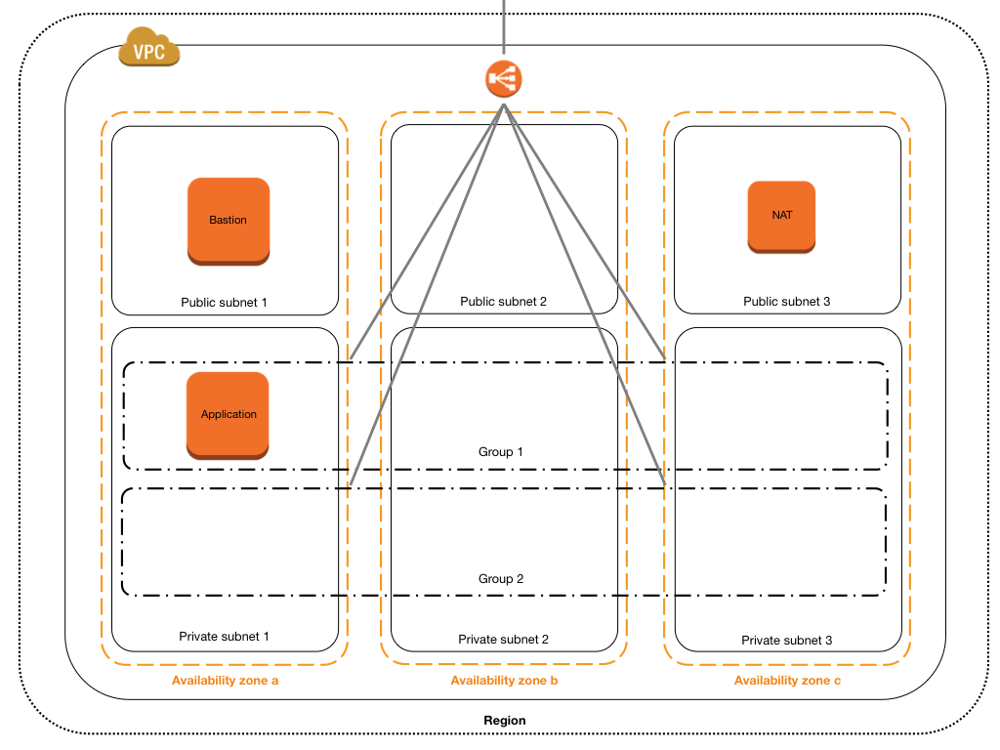

Minimal scalable template
=========================
Here's a minimal CloudFormation template that's designed to be:

* low cost
* scale up or down depending on load and preference
* support zero downtime deployments
* require only an AWS account, Route 53 hosted zone and key pair

What does it look like?
-----------------------

How do I get started?
---------------------
If you have an AWS account, a Route 53 hosted zone and a key pair, you're ready to go. Choose `Create a Stack` on the CloudFormation welcome page. Under `Choose a template`, select `Upload a template to S3` and pick the file `minimal.template` from the [cloudformation](cloudformation) folder of this repo. Press `Next` to go to the parameter screen, where you can keep the defaults but need to supply:

* stack name (e.g. stack01)
* Route 53 hosted zone (e.g. example.com.)
* key pair (e.g. `ci_user`)

Press `Next` again and, on the next screen, acknowledge that the template will create IAM users. Pressing `Create` will build the stack.

How does it work?
-----------------
The template sets up a VPC with load balancer, bastion, NAT, two scaling groups and initially one application server.

The bastion and application servers are initialized by puppet during stack creation. See modules `bastion` and `application` in folder [puppet](puppet).

Note that the template creates IAM users for the bastion and application hosts. `ec2-user` on the bastion host is able to run deployments, but not allowed to access AWS APIs that are not strictly required. The application server's system user has no permissions by default, but in praxis it is likely to require access to various APIs or at least read-only access to one or more S3 buckets.

I've got the stack. Where's the application?
------------------------------------------------
The load balancer URL (along with the bastion host's CNAME and other useful strings) is available from the Outputs panel of the CloudFormation console. 

You can also construct it as follows:

    http://[stack name].[region].[hosted zone]

For the default values given above, this adds up to:

    http://stack01.eu-west-1.example.com

The application is of course a stub and bound to disappoint fans of elaborate web design.

If you must know, the application is as plain and simple as [this](https://rawgit.com/gerald1248/minimal-scalable-template/master/puppet/application/files/docroot/index.html).

How do I deploy the latest code?
--------------------------------
To keep things simple 'new code' here means the `application` has changed in the specified Git repo and branch. (Real life scenarios are likely to involve local `rpm` or `apt` repos and mirrors, S3 buckets, and perhaps a neat staging process. The trouble is that these add a lot of dependencies that don't suit a *minimal* template.) To deploy your merged changes, instruct your preferred CI tool (Jenkins, say) to perform the following steps:

    # let's assume:
    # the stack name is stack01
    # the Route 53 hosted zone is example.com.
    # the private key is ci_user.pem
    ssh -i ~/.ssh/ci_user.pem -o StrictHostKeyChecking=no ec2-user@stack01-bastion.eu-west-1.example.com
    python scripts/deploy.py

What happens next?
------------------
The expected output is:

    [ec2-user@ip-10-0-1-100 ~]$ python scripts/deploy.py
    Active group: stack01-Group1-OU6GXZ5HRQDH
    Passive group: stack01-Group2-HOXIWD54M30G
    Activating stack01-Group2-HOXIWD54M30G
    ........
    Deactivating stack01-Group1-OU6GXZ5HRQDH
    Deployment successful 

What happened there? The script checks which of the two autoscaling groups is currently active. It then raises the number of instances in the passive group to match the active group's strength. When both groups are at full strength (as confirmed by the load balancer's health check), the old active group is reduced to zero instances. The old active group is now the passive group and the new code is live.

Can I take a look around the private subnets?
---------------------------------------------
If you wish to use the bastion server as a jump host to the private subnets, check the AWS console for the application server's private IP address and log in as follows:

    # let's say the parameters haven't changed
    # the application is part of a scaling group,
    # so the IP address isn't fixed 
    ssh-add ~/.ssh/ci_user.pem
    ssh -A -o StrictHostKeyChecking=no ec2-user@stack01-bastion.eu-west-1.example.com 
    # the application server has IP 10.0.4.103
    ssh 10.0.4.103

Couldn't you have used (Go|Node.js|Ruby)?
-----------------------------------------------------
Yes, absolutely. Ports of the Python deployment script (`deploy.py`) are very welcome.

Why didn't you include AMIs for other regions?
----------------------------------------------
Mostly to avoid code bloat. CloudFormation templates are unwieldy at the best of times, and including AMI IDs for all regions would make the template a lot harder to read.

But wait, what about the other parameters?
------------------------------------------
There's no need to worry about the other parameters right away. For example, there's a low-cost instance option in addition to the default. Counter-intuitively free tier users only have access to the slightly more expensive (micro not nano) option, making it a useful default.

I've spotted a bug
------------------
Fork away. All pull requests are welcome!

What's with the broken light down the center of the neon sign?
--------------------------------------------------------------
If you know why it's broken your (working) repair pull request will be merged right away. 
